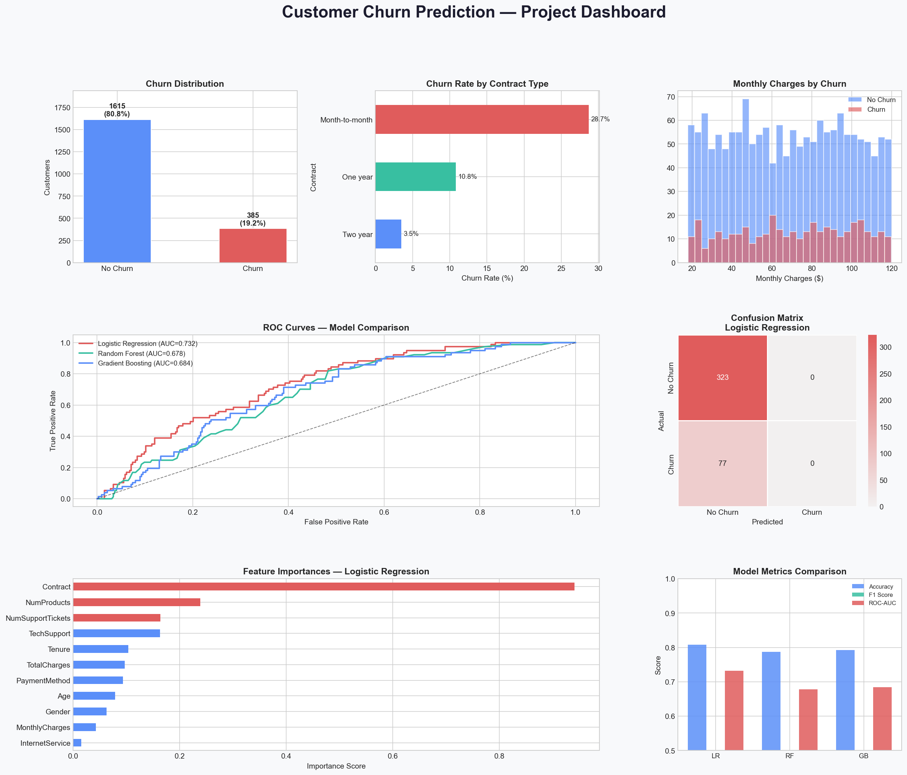

# Customer Churn Prediction System

A machine learning project that predicts whether a customer is likely to leave a company (customer churn) based on customer data. This project helps businesses identify customers at risk and take preventive actions to improve customer retention.

## 📌 Features

- Customer churn prediction using Machine Learning
- Data preprocessing and cleaning
- Model training and evaluation
- Prediction on new customer data
- Saves prediction results to a CSV file
- Dashboard visualization of results

---

## 🛠️ Technologies Used

- Python
- Pandas
- NumPy
- Scikit-learn
- Matplotlib
- Seaborn

---

## 📂 Project Structure

```
Customer_Churn_Prediction_System/
│── customer_churn_prediction.py   # Main Python script
│── churn_dataset.csv              # Dataset used for training
│── churn_predictions.csv          # Generated predictions
│── churn_dashboard.png            # Dashboard screenshot
│── README.md
```

---

## 🚀 How to Run

### 1. Clone the repository

```bash
git clone https://github.com/Yodigx/Customer_Churn_Prediction_System.git
```

### 2. Navigate to the project folder

```bash
cd Customer_Churn_Prediction_System
```

### 3. Install the required libraries

```bash
pip install pandas numpy matplotlib seaborn scikit-learn
```

### 4. Run the project

```bash
python customer_churn_prediction.py
```

---

## 📊 Output

The project:

- Loads and preprocesses the customer dataset.
- Trains a machine learning model.
- Predicts customer churn.
- Saves the predictions to **churn_predictions.csv**.
- Displays dashboard visualizations.

---

## 📸 Dashboard



---

## 🎯 Future Improvements

- Build a web application using Streamlit or Flask.
- Add multiple machine learning algorithms for comparison.
- Improve model accuracy through hyperparameter tuning.
- Deploy the model on the cloud.
- Add real-time customer prediction.

---

## 🤝 Contributing

Contributions are welcome. Feel free to fork the repository and submit a pull request.

---

## 📄 License

This project is for educational and learning purposes.

---

## 👨‍💻 Author

**Shreyas Ingle**

GitHub: https://github.com/Yodigx